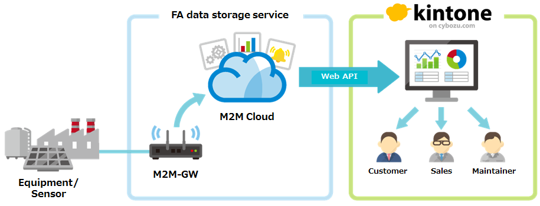

# Machine to machine to human (M2M2H)

## Machine to machine (M2M)
Machine to machine (M2M) refers to technologies that allow both wireless and wired systems to communicate with other devices of the same type. M2M is a broad term as it does not pinpoint specific wireless or wired networking, information and communications technology. This broad term is particularly useful for business executives. - ["M2M" *Wikipedia*: *The Free Encyclopedia*](http://en.wikipedia.org/wiki/Machine_to_machine "Machine to machine")

## M2M2kintone repository contents
* **/RSMicro** - Temperature and humidity sensor
* **/Koubachi** - WiFi plant sensor

## M2M2kintone via "FA data storage service"
In this repository section, sample codes is provided for M2M using kintone.

cf. ["FA data storage service"](http://www.megakiku.jp/fadss/ "FA data storage service") is a cloud-based M2M service provided by [Nishimu Electronics Industries Co.,Ltd.](http://www.nishimu.co.jp/index-e.html "Nishimu Electronics Industries Co.,Ltd.")

## See also
* M2M2H of Cybozu [ [Japanese](http://www.itmedia.co.jp/enterprise/articles/1401/23/news026.html) ]
* M2M2H presentation at "cybozu.com conference 2013" [ [slideshare (Japanese)](http://www.slideshare.net/cybozucommunity/c-4m2-m2kintone) ]
* M2M2H for maintainance of PV systems [ [YouTube (Japanese)](https://www.youtube.com/watch?v=BLdzqkVK3eo&list=UUtjym6vNLw-vFBpcYXijsFA) ]
* FA data storage service [ [Japanese](http://www.megakiku.jp/fadss/ "FA data storage service") ]