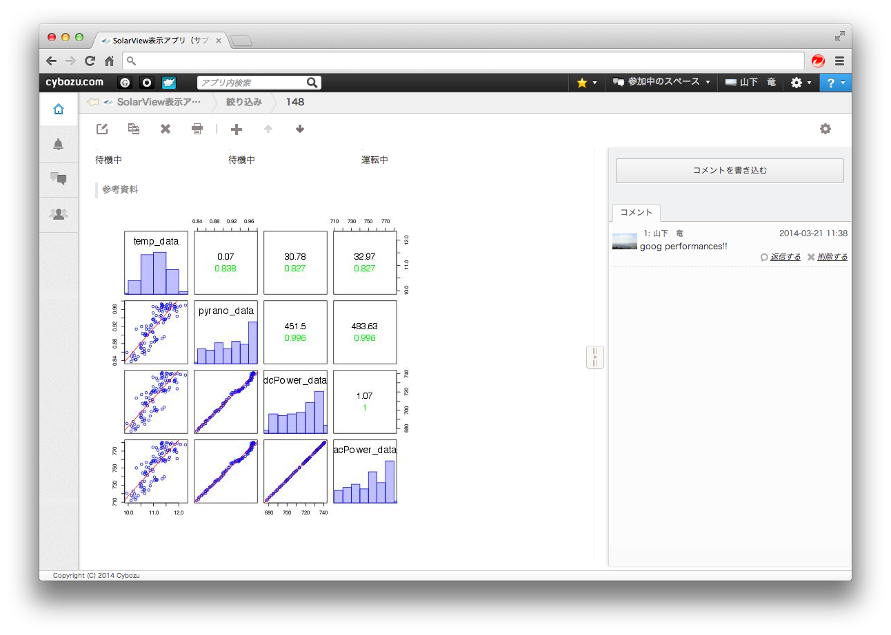

# Simple Correlation Analysis based on kintone data for Photovoltaic(PV) Systems

This is an example of plotted correlation matrix of PV parameters.

The lower triangular matrix represents scatters among parameters. The upper triangular matrix represents correlation values(lower side) and efficiency values of power conversion(upper side). The diagonal represents hisgrams of AC output distribution.

## Dependence packages
* kintone
* RCurl
* XML

## Result

